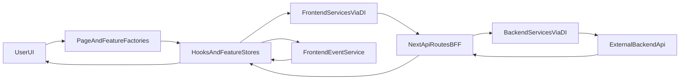

# Architecture Blueprint (Korrasat Pattern)

This document explains how this app is designed so you can reproduce the same system in a new project.

It covers:
- Layered architecture
- Component composition style
- Hooks and local store patterns
- OOP/class model
- Dependency injection
- Event system
- End-to-end runtime flows
- Replication rules and implementation roadmap

---

## 1) Architecture At A Glance

The application uses **Next.js App Router** with a **BFF (`/api`) layer** and a strict **DI + service/client** architecture.



### Core principle
- UI never calls external backend directly.
- UI calls **frontend services** (resolved from `getFrontendContainer()` in [`src/container/frontend.ts`](src/container/frontend.ts)).
- Frontend services call **Next API routes** (`/api/...`).
- API routes call **backend services** (resolved from `getBackendContainer()` in [`src/container/backend.ts`](src/container/backend.ts)).
- Backend services call upstream backend (`BACKEND_URL`).

### Implementation in this repository (golden slice)
- **App entry (home feature):** [`src/app/(home)/page.tsx`](src/app/(home)/page.tsx) composes [`src/app/(home)/factory.tsx`](src/app/(home)/factory.tsx) (provider pipeline: `state.tsx` → `api.tsx` → `observer.tsx` → `utils.tsx` → [`ui/factory.tsx`](src/app/(home)/ui/factory.tsx)).
- **Projects domain:** [`src/modules/projects/`](src/modules/projects/) with mirrored `abstraction/`, `frontend/`, `backend/`, and [`names.ts`](src/modules/projects/names.ts).
- **BFF routes:** [`src/app/api/projects/route.ts`](src/app/api/projects/route.ts), [`src/app/api/projects/[id]/route.ts`](src/app/api/projects/[id]/route.ts).
- **Events:** [`src/modules/events/`](src/modules/events/), hook [`src/hooks/events-observer.ts`](src/hooks/events-observer.ts).
- **Store infra:** [`src/hooks/store-provider/`](src/hooks/store-provider/) (`createComponentWithProvider`, `useSyncExternalStore`, `useCallAction`, `useSubscribeAction`).
- **Env sample:** [`.env.local.example`](.env.local.example).

**Next.js note:** the app lives under [`src/app/`](src/app/). Do not leave an empty root-level `app/` directory; Next.js would prefer it over `src/app/` and your routes would disappear from the build.

---

## 2) Layered Architecture

## 2.1 Route/Page Layer (App Router)
- Location: `src/app/...` (this repo: `src/app/(home)/...`; add `src/app/[locale]/...` when you wire full i18n routing).
- Responsibility: compose page-level providers/factories and pass server data.
- Example composition: [`src/app/(home)/factory.tsx`](src/app/(home)/factory.tsx)

Pattern:
- Use factory-like component that wraps:
  - State provider
  - Api provider
  - Observer provider
  - Utils provider
  - Guard/modals
  - UI factory

## 2.2 UI/Feature Layer
- Location: `src/app/(feature)/**/ui` (e.g. [`src/app/(home)/ui/`](src/app/(home)/ui/)) and shared [`src/components/**`](src/components/)
- Responsibility: rendering + user interaction only.
- Rule: keep API concerns in service/hooks/store boundary; avoid raw fetch/axios in presentational components.

## 2.3 Hooks + State Layer
- Location: `src/hooks/**` and feature `store/**`
- Responsibility:
  - Sync query results into local store mirrors.
  - Observe global events.
  - Bridge server data into client usage.
  - Provide reusable state infra (`store-provider`).

## 2.4 Frontend Domain Service Layer
- Location: `src/modules/<domain>/frontend/**`
- Responsibility: typed use-cases for browser side (`Create`, `Find`, `Update`, `Delete`, etc.).
- Implementation style: class-based services injecting class-based clients.

## 2.5 BFF Layer (Next API Routes)
- Location: `src/app/api/**/route.ts`
- Responsibility:
  - Parse request params/body.
  - Resolve backend service from DI.
  - Pass JWT token when needed.
  - Return normalized JSON response/errors.

## 2.6 Backend Domain Service Layer
- Location: `src/modules/<domain>/backend/**`
- Responsibility: typed use-cases for server side (inside Next API routes).
- Delegates to backend client abstraction (Axios over `BACKEND_URL`).

## 2.7 Infrastructure Layer
- DI containers: `src/container/**`
- HTTP clients:
  - Front: `src/lib/clients/frontend-instance.ts`
  - Back: `src/lib/clients/backend-instance.ts`
- Shared abstractions:
  - Axios abstraction: `src/modules/axios/abstraction/axios.ts`
  - Event core: `src/modules/events/logic.ts`

---

## 3) Component Design Pattern

The feature entrypoint uses a **Factory + Provider Pipeline** pattern.

### Standard shape
1. `Factory` decides feature mode (for example: `dashboard` vs `website`).
2. It composes providers in deterministic order.
3. It renders `UIFactory`.

Recommended provider order (default feature):
1. `AuthGuard` (if protected flow)
2. `State`
3. `Api`
4. `Observer`
5. `Utils`
6. feature-local modals/overlays
7. `UIFactory`

Why this order:
- state first so everything can read/write state
- api next to fetch/mutate and sync state
- observer after api so event listeners see ready state/actions
- utils last for derived behavior and side tools

---

## 4) Hooks Blueprint

## 4.1 `useEventObserver`
- File: [`src/hooks/events-observer.ts`](src/hooks/events-observer.ts)
- Purpose: subscribe/unsubscribe to typed event bus events.
- Usage: `useEventObserver("eventName", handler)`.
- Backed by singleton `EventService` from `frontendContainer`.

## 4.2 Store-provider factory hooks
- Files: [`src/hooks/store-provider/factory.tsx`](src/hooks/store-provider/factory.tsx), [`src/hooks/store-provider/store-api.ts`](src/hooks/store-provider/store-api.ts), [`src/hooks/store-provider/types.ts`](src/hooks/store-provider/types.ts)
- Purpose: build feature-local reactive stores with:
  - `useStore`
  - `useStoreApi`
  - `useSyncFrom`
  - `useInitializeOnce`
  - `useCallAction`
  - `useSubscribeAction`
  - `useSubscribeStore`
- Extra concept: `pushId` enables scoped action/state dispatch among multiple instances.

## 4.3 Server-data bridge
- Files:
  - `src/components/server-data-registry/server-data-registry.tsx`
  - `src/hooks/use-server-data.ts`
- Purpose: pass server-calculated values to client side via registry hook pattern.

## 4.4 Mirror-style feature store
- This repo: [`src/app/(home)/store/index.ts`](src/app/(home)/store/index.ts) (composed from [`state.ts`](src/app/(home)/store/state.ts), [`api.ts`](src/app/(home)/store/api.ts), [`utils.ts`](src/app/(home)/store/utils.ts)); wired via [`src/app/(home)/store-context.tsx`](src/app/(home)/store-context.tsx).
- Purpose: merge local state + API state + utility state into one small feature store.

---

## 5) OOP / Classes Design

The architecture is explicitly class-based.

## 5.1 Service class per side
- `src/modules/<domain>/frontend/service.ts`
- `src/modules/<domain>/backend/service.ts`

Both services expose same use-case language (`Create`, `Find`, `FindOne`, `Update`, `Delete`) with side-specific params.

## 5.2 Client class per side
- `src/modules/<domain>/frontend/client.ts`
- `src/modules/<domain>/backend/client.ts`

Clients own HTTP transport details and endpoint mapping.

## 5.3 Shared abstractions
- Domain abstraction files in `abstraction/**`.
- Shared types between front/back where possible to keep contracts aligned.

Rule:
- Service contains business/use-case orchestration.
- Client contains transport implementation.
- Route handler contains request mapping only.

---

## 6) Dependency Injection Design (Inversify)

## 6.1 Containers
- Root parent: [`src/container/container.ts`](src/container/container.ts) (reserved for future shared bindings).
- Browser-side container: [`src/container/frontend.ts`](src/container/frontend.ts) (`getFrontendContainer()`).
- Server-side container: [`src/container/backend.ts`](src/container/backend.ts) (`getBackendContainer()`).

Each side uses a dedicated Inversify `Container` assembled with the binder pipeline [`src/container/pipe.ts`](src/container/pipe.ts) (`pipe(...)`). **Inversify 7** in this project does not use `createChild()`; frontend and backend are separate container instances, which matches the intended separation of browser vs server graphs.

## 6.2 Binder modules
- Location: [`src/container/bindings/`](src/container/bindings/) (e.g. [`projects-frontend.ts`](src/container/bindings/projects-frontend.ts), [`projects-backend.ts`](src/container/bindings/projects-backend.ts), [`axios-frontend.ts`](src/container/bindings/axios-frontend.ts), [`events-frontend.ts`](src/container/bindings/events-frontend.ts))
- Each binder registers one module's:
  - state/client/service symbols
  - frontend or backend side implementations
  - singleton/transient lifecycle as needed

## 6.3 Naming tokens
- Domain names file: [`src/modules/projects/names.ts`](src/modules/projects/names.ts)
- Rule: resolve dependencies by module token constants, never hardcoded string scattered across layers.

---

## 7) Event System

## 7.1 Event core
- File: [`src/modules/events/logic.ts`](src/modules/events/logic.ts) (`EventCore`, `EventEmitter`)
- Built on `EventEmitter`.
- Typed event map `IEvents` from domain event type unions.

Methods:
- `send(event, payload)`
- `register(event, cb)`
- `remove(event, cb)`

## 7.2 Event service facade
- [`src/modules/events/service.ts`](src/modules/events/service.ts) — token [`EVENT_SERVICE`](src/modules/events/names.ts) in frontend DI ([`events-frontend.ts`](src/container/bindings/events-frontend.ts)).

## 7.3 Hook integration
- `useEventObserver` subscribes in `useEffect` and auto-unsubscribes on cleanup.

Rule:
- Use event bus for decoupled cross-feature reactions.
- Do not replace all local state with events; keep events for cross-cutting signals.

---

## 8) End-To-End Flows

## 8.1 Read flow (example: find projects)
1. UI mounts and [`src/app/(home)/api.tsx`](src/app/(home)/api.tsx) runs React Query.
2. Query calls `ProjectsFrontendService.Find()` from [`getFrontendContainer()`](src/container/frontend.ts).
3. [`ProjectsFrontendClient`](src/modules/projects/frontend/client.ts) calls `/api/projects` (Axios `baseURL` `/api`).
4. [`src/app/api/projects/route.ts`](src/app/api/projects/route.ts) maps query + `Authorization` header.
5. Route resolves `ProjectsBackendService` via [`getBackendContainer()`](src/container/backend.ts).
6. Backend service delegates to [`ProjectsBackendClient`](src/modules/projects/backend/client.ts).
7. Backend client calls upstream `GET {BACKEND_URL}/projects`.
8. JSON flows back through the BFF to the browser.
9. [`useSyncFrom`](src/hooks/store-provider/factory.tsx) mirrors data into the feature store; React Query cache updates.

## 8.2 Write flow (example: create project)
1. UI action triggers `ProjectsFrontendService.Create` (same client stack as read).
2. `POST /api/projects` handled by [`route.ts`](src/app/api/projects/route.ts).
3. Route extracts bearer token, maps body, calls `ProjectsBackendService.Create`.
4. Upstream response returned as JSON.
5. Invalidate queries or emit a typed event (e.g. `projectCreated` in [`src/modules/events/types/index.ts`](src/modules/events/types/index.ts)) for decoupled listeners ([`observer.tsx`](src/app/(home)/observer.tsx)).

---

## 9) Folder Layout Template (Replication)

Use this for each domain module:

```txt
src/modules/<domain>/
  names.ts
  index.ts
  abstraction/
    client.ts
    endpoint.ts
    types.ts
  frontend/
    client.ts
    service.ts
    types.ts
    commands/        (optional)
  backend/
    client.ts
    service.ts
    types.ts
```

Use this for a feature page (this repo uses `src/app/(home)/` as the first feature):

```txt
src/app/(<feature>)/
  page.tsx
  factory.tsx
  state.tsx
  api.tsx
  observer.tsx
  utils.tsx
  ui/
    factory.tsx
    ...components
  store/
    index.ts
    state.ts
    api.ts
    utils.ts
```

---

## 10) Strict Replication Rules

If you want a new project to be architecturally identical, enforce these rules:

1. **Keep BFF boundary**: browser calls only `/api/*`; no browser call to upstream backend.
2. **Enforce DI**: no direct `new Service()` in app code; resolve via `frontendContainer` or `backendContainer`.
3. **Keep service/client split**: service orchestrates use-case, client does transport.
4. **Mirror front/back module shape**: every frontend domain service has backend pair.
5. **Class-based domain code**: use injectable classes for service/client, not ad-hoc function collections.
6. **Typed tokens**: domain `names.ts` for DI identifiers.
7. **Typed events**: event names and payloads centrally typed.
8. **Feature provider pipeline**: State -> Api -> Observer -> Utils -> UI.
9. **No hidden cross-feature dependencies**: use event bus or explicit service call.
10. **Error normalization in routes**: consistent `NextResponse.json` success/error payload shape.

---

## 11) Roadmap To Build A New Project (Same Architecture)

## Phase 1: Foundation
- Scaffold Next.js App Router + TypeScript under [`src/app/`](src/app/).
- Core libs in use: Inversify, reflect-metadata, Axios, Ramda, TanStack Query, next-auth (dependency; routes not wired yet), next-intl.
- DI: [`src/container/container.ts`](src/container/container.ts) + [`frontend.ts`](src/container/frontend.ts) / [`backend.ts`](src/container/backend.ts) + [`bindings/`](src/container/bindings/).
- Axios instances: [`src/lib/clients/frontend-instance.ts`](src/lib/clients/frontend-instance.ts), [`src/lib/clients/backend-instance.ts`](src/lib/clients/backend-instance.ts).

## Phase 2: Architecture Skeleton
- Add module template directories (`abstraction/frontend/backend`).
- Create first domain end-to-end (for example `projects`) as golden pattern.
- Add `/api/<domain>/route.ts` as BFF endpoint.

## Phase 3: Feature Composition
- Build one feature page with `factory.tsx` and provider pipeline.
- Implement feature store mirror and local hooks.
- Add event observer integration for one cross-feature action.

## Phase 4: Auth + Session
- Configure next-auth route and token flow.
- Ensure API routes extract token and forward upstream.

## Phase 5: Scale
- Add additional domains using exact template.
- Add binders for each domain in both containers.
- Keep naming and folder conventions identical.

## Phase 6: Quality Controls
- Add architecture checks (PR checklist from this doc).
- Review every new domain against strict replication rules.

---

## 12) Architecture Parity Checklist

Use this checklist when validating a new repository:

- [ ] Next.js App Router (`src/app/`); add locale segments when product requires them.
- [ ] `frontendContainer` and `backendContainer` both exist and are child containers.
- [ ] Domain binders are split by side (front/back) and assembled with `pipe(...)`.
- [ ] Browser HTTP base URL points to `/api`.
- [ ] Backend HTTP base URL points to environment-defined upstream API.
- [ ] Every domain has `abstraction/frontend/backend` folder set.
- [ ] Every domain has class-based `Service` and `Client`.
- [ ] API route handlers only map request/response + service call.
- [ ] Token extraction pattern is consistent in protected routes.
- [ ] Feature pages use provider pipeline via `factory.tsx`.
- [ ] Feature store pattern implemented (`state/api/utils` composition).
- [ ] Event bus core exists and uses typed events.
- [ ] `useEventObserver`-style hook handles subscribe/unsubscribe lifecycle.
- [ ] No direct upstream backend calls from client components/hooks.
- [ ] Naming/token conventions are centralized per module.

---

## 13) Quick Start For New Project

1. Copy this file into new project root as architecture contract.
2. Copy `CURSOR_BOOTSTRAP_PROMPTS.md` and run prompts in order.
3. Ask Cursor to scaffold one golden domain (`projects`) first.
4. Do parity checklist after each phase.
5. Only then scale to remaining domains.

This sequence gives high fidelity reproduction with minimal architecture drift.
